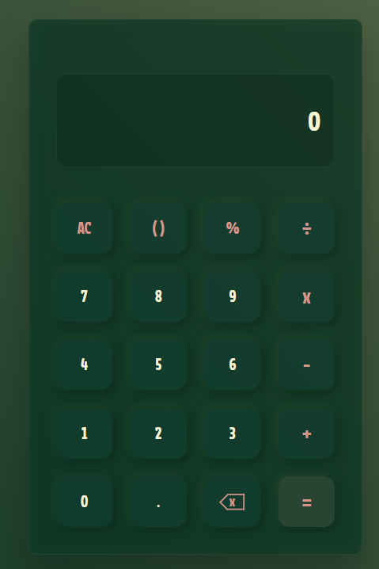
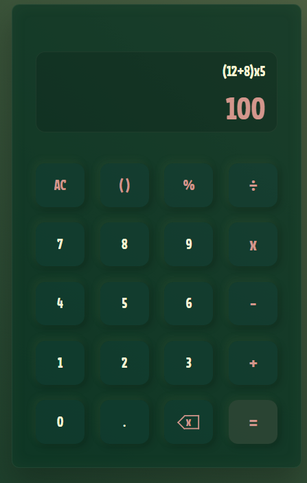
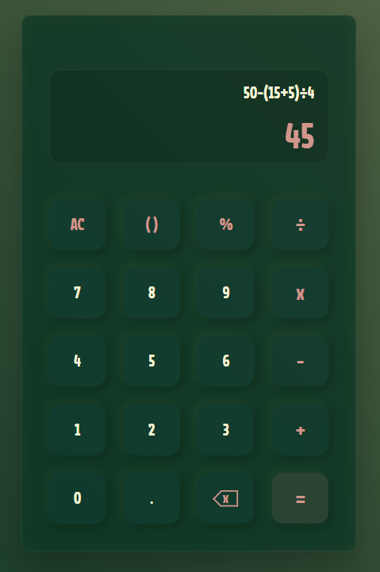
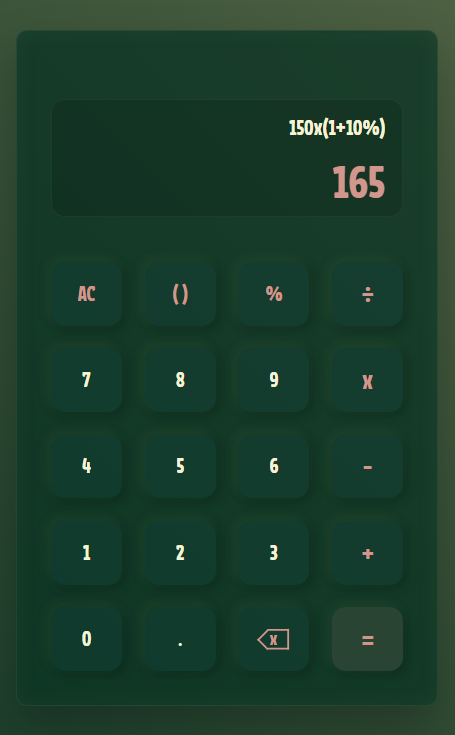

# Calculadora



Uma calculadora web desenvolvida durante meus estudos de JavaScript.

A ideia deste projeto foi praticar lógica de programação e manipulação do DOM
a partir de uma aplicação pequena, mas com diferentes situações de entrada e
operação.

## Funcionalidades

- Operações básicas de adição, subtração, multiplicação e divisão
- Números decimais
- Porcentagens
- Operações com parênteses
- Backspace para editar a expressão
- Limpeza da expressão
- Continuação da operação após o cálculo
- Validação de entradas
- Tratamento de resultados inválidos

## Alguns exemplos

Além das operações básicas, a calculadora também consegue lidar com expressões
que combinam diferentes operadores e regras matemáticas.

### Operação com parênteses



### Parênteses e divisão



### Multiplicação, parênteses e porcentagem



## Tecnologias

- HTML5
- CSS3
- JavaScript

## O que pratiquei

Durante o desenvolvimento, trabalhei principalmente com:

- Manipulação do DOM
- Eventos de clique
- Controle de estado
- Funções e condicionais
- Manipulação de strings
- Expressões regulares
- Validação de entradas
- Tratamento de erros

## Estrutura

```text
calculadora/
├── assets/
│   ├── calculadora.png
│   ├── calculadora-parenteses.png
│   ├── calculadora-divisao.png
│   └── calculadora-porcentagem.png
├── index.html
├── style.css
├── script.js
└── README.md